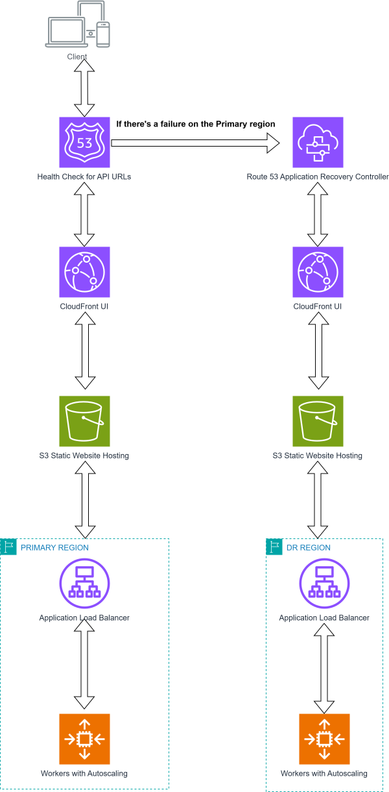

###

Sovereign-Stack provides a modular, self-hosted Kubernetes architecture designed for regulatory compliance and cost-efficiency.

### Key Architectural Pillars:
- **Modular Wrapper**: A Go-based CLI (`sov-cli`) orchestrates the lifecycle of the stack across multiple regions.
- **Dynamic Networking**: Support for variable availability zones and CIDRs to ensure high availability and tier isolation (Public, Private, Database).
- **Pilot Light DR**: Cross-region disaster recovery with minimal standby costs, using S3 for state and OIDC discovery.
- **Self-Hosted K8s**: Control plane and workers run on EC2 instances with Podman/CRI-O, avoiding EKS management fees.

Diagramatic image of the architecture at a low level:

